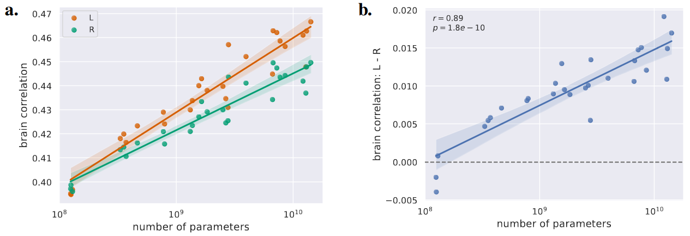

# Source code for ["fMRI predictors based on language models of increasing complexity recover brain left lateralization"](https://proceedings.neurips.cc/paper_files/paper/2024/hash/e28e19d00b23fe0265f433fa05a96b06-Abstract-Conference.html)
by Laurent Bonnasse-Gahot and Christophe Pallier



fMRI predictors based on language models of increasing complexity recover brain left lateralization for language, and the difference in brain score between left and right hemisphere follows a scaling law.

This repository contains the source code for our [paper](https://proceedings.neurips.cc/paper_files/paper/2024/hash/e28e19d00b23fe0265f433fa05a96b06-Abstract-Conference.html) accepted at the 38th Conference on Neural Information Processing Systems (NeurIPS 2024). See Citation and BibTeX reference at the bottom of this README.

:warning: If you use code from this repository, please cite this repository using the reference provided by clicking the link with the label "Cite this repository" in the right sidebar.

## Dependencies

### Python modules

See `requirements.txt` for the full list of packages used in this work. This file provides the exact version that was used, but the code is expected to work with other versions as well.

It is recommended to create a virtual environment to install the python modules, for example:

With Anaconda

    conda create --name lpp python=3.10
    conda activate lpp
    pip install -r requirements.txt

Or with Pyenv

    pyenv virtualenv 3.10 lpp
    pyenv activate lpp
    pip install -r requirements.txt

Once the environment is installed, you can launch `jupyter notebook` or `jupyter lab` to execute the python files (`.py`) or the notebooks (`.ipynb`) with the `%run` command.

### Set up paths and hugginface access_token

You must edit the [llms_brain_lateralization.py](llms_brain_lateralization.py) file to set the two following variables:
+ `lpp_path`, that points to the data directory (fMRI derivatives and annotations) downloaded from [*Le Petit Prince* OpenNeuro dataset](https://doi.org/10.18112/openneuro.ds003643.v2.0.5);
+ `home_folder`, that points to your local copy of the present repository, where all the computations occur and where the analyses and figures will be stored.

In the same file, you should provide a valid `access_token` to access the various models in huggingface that require authentication.


### Get *Le Petit Prince* annotations

In order to reproduce the main results of the paper (in English), you need to download `lppEN_word_information.csv` in `annotation/EN/` from [*Le Petit Prince* OpenNeuro repository](https://doi.org/10.18112/openneuro.ds003643.v2.0.5). This file must be placed in a subfolder of `lpp_path` that has the same path as in the original data (i.e., `annotation/EN/`).

### Get GloVe embeddings

Download the _GloVe embeddings_ and unzip in the `home_folder`:

	wget https://huggingface.co/stanfordnlp/glove/resolve/main/glove.6B.zip
	unzip glove.6B.zip


## Pre-processing of the fMRI Data
:warning: **The relevant files are directly available in this repository so you can skip these steps and jump to the next section** :warning:, unless you want to recompute them, which is necessary for the individual subject analyses.

The following steps compute, for English, the average fMRI subject, the corresponding mask, the roi masks, and the estimate of the inter-subject correlation (to process French and Chinese data, replace `EN`/`en` with `FR`/`fr` or `CN`/`cn`).

1. Download the `derivatives/EN/` folder from the [original fMRI dataset](https://doi.org/10.18112/openneuro.ds003643.v2.0.5) (described in [Li et al., 2022](https://doi.org/10.1038/s41597-022-01625-7)) in the folder pointed by the `lpp_path` variable.

1. Resample fMRI data to 4x4x4mm voxels:

        python resample_fmri_data.py --lang en

1. Create a mask common to all subjects:

        python compute_mask.py --lang en

   to generate `mask_lpp_en.nii.gz`

1. Create the 7 roi masks used in the paper:

        python create_roi_masks.py

1. Compute the average subject

        python compute_average_subject_fmri.py --lang en

   This script also computes an evaluation of the inter-subjects reliable voxels and produces `isc_10trials_en.gz` which contains, for each voxel, an estimate of the inter-subject correlation (isc), the correlation between an average subject made from half of the subjects and predicted values from held-out runs using another average subject made from the other half of the subjects as regressors (and this 10 times, using different group partitions).

## Main analyses of the paper
1. Extract activations from LLMs.

        python extract_llm_activations.py --model XXX --lang en

   to get output of the neurons of each layer of model `XXX`; for instance, for `gpt2`:

        python extract_llm_activations.py --model gpt2 --lang en

   In order to extract from the all models, one can use the following bash lines:

        while read -r model_name; do
            python extract_llm_activations.py --model $model_name --lang en
        done < model_list_en

1. Fit the average fMRI subject using ridge regression. Run the script `fit_average_subject.py`. For instance, using the activations from gpt2 as extracted in the previous step, run `python fit_average_subject.py --model gpt2 --lang en`. In the paper, the whole model list described above is used, as follows (in bash):

        while read -r model_name; do
            python fit_average_subject.py --model $model_name --lang en
         done < model_list_en

1. Compute the baselines (random vectors, random embeddings and GloVe).

    For GloVe, first download the [GloVe embeddings](https://nlp.stanford.edu/projects/glove/). Then run

	    python extract_glove_activations.py

	to extract the embeddings, then

	    python fit_average_subject.py --model glove

	to fit to the fMRI brain data.

   For the random baselines, use `generate_random_activations.py`. The paper uses the following bash code:

        for type in vector embedding
        do
            for d in 300 1024
            do
                for i in {1..10}
                do
                      python generate_random_activations.py --type $type --n_dims $d --seed $i --lang en;
                      python fit_average_subject.py --model random_${type}_${d}d_seed${i} --lang en;
                done
            done
        done

1. Analyze and visualize all the results, as described in the paper:

   %run [analyze_results.ipynb](analyze_results.ipynb)

## Additional analyses

### Impact of model training

+ Untrained models

  Use the same script as before to extract the activation, but using the `--seed` option with a value for the seed > 0. For instance:

      python extract_llm_activations.py --model gpt2 --seed 1 --lang en

  The activations are then saved with the "_untrained_seed1" suffix here. Following the example with gpt2, fitting this untrained model is then performed using the following command:
      python fit_average_subject.py --model gpt2_untrained_seed1 --lang en

+ Pythia

      for step in 0 1000 14000 36000 72000 143000
      do
      	python extract_llm_activations.py --model pythia-6.9b_step${step} --lang en
      	python fit_average_subject.py --model pythia-6.9b_step${step} --lang en
      done

See [analyze_results_training.ipynb](analyze_results_training.ipynb) for the analysis and visualization of the results.

### Other languages: Chinese and French

Same pipeline as described above for English, but using the `--lang cn` option for Chinese and `--lang fr` for French. See [analyze_results_cn_fr.ipynb](analyze_results_cn_fr.ipynb) for the analysis and visualization of the results with the Chinese or French data.

###  Individual analyses

These analyses require to download the individual fMRI data and to follow the pipeline described in the above section Pre-processing of the fMRI Data. In the paper, we analyze the first five English subjects, using the following bash script that uses the `fit_individual_subject.py` Python script:

```
for sub_id in EN057 EN058 EN059 EN061 EN062
do
  for model_name in gpt2 gpt2-medium gpt2-large gpt2-xl Qwen1.5-0.5B Qwen1.5-1.8B Qwen1.5-4B Qwen1.5-7B Qwen1.5-14B
  do
      python fit_individual_subject.py --model $model_name --subject $sub_id;
  done
done
```

See [analyze_results_individuals.ipynb](analyze_results_individuals.ipynb) for the analysis and visualization of the results.

## Citation and BibTeX reference
```
Bonnasse-Gahot, L., & Pallier, C. (2024).
fMRI predictors based on language models of increasing complexity recover brain left lateralization.
Advances in Neural Information Processing Systems, 37, 125231-125263.
```

```
@article{bonnasse-gahot2024fmri,
  title={fMRI predictors based on language models of increasing complexity recover brain left lateralization},
  author={Bonnasse-Gahot, Laurent and Pallier, Christophe},
  journal={Advances in Neural Information Processing Systems},
  volume={37},
  pages={125231--125263},
  year={2024}
}

```
